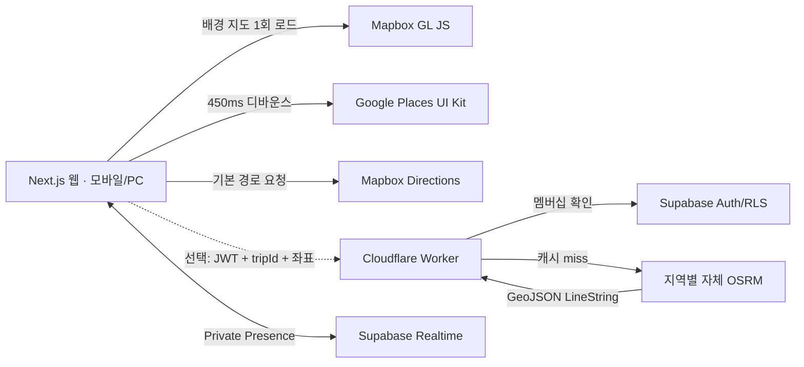

# 가성비 지도 버전 아키텍처

이 문서는 Next.js 앱에서 `Mapbox GL JS/Mapbox Directions + Google Places UI Kit + Supabase Realtime` 조합을 운영하는 방법을 설명한다. 지도 렌더러와 기본 자동차 경로는 Mapbox로 통일하고, Google은 검색 결과 UI와 원본 장소 링크에만 사용한다. 자체 OSRM 경로 Worker는 선택 사항이다.

## 1. 핵심 구조



- 지도 드래그와 줌은 Mapbox 내부에서 처리한다. Google 지도 객체는 만들지 않는다.
- 일정의 2~25개 장소는 한 번의 Mapbox Directions 요청에 경유점으로 전달한다. 순서는 일정 순서를 보존한다.
- `NEXT_PUBLIC_ROUTE_API_URL`을 지정하면 Mapbox Directions 대신 자체 OSRM Worker를 사용한다.
- Worker는 Supabase JWT와 `trip_members`를 확인한 후에만 OSRM을 호출한다.
- 동일 좌표열의 경로는 Cloudflare Cache API에 하루 동안 저장한다.
- GPS 공유는 사용자가 버튼을 누른 경우에만 시작하고, 15m 이상 이동하거나 8초가 지난 경우에만 Presence를 갱신한다.

## 2. Google Places 정책상 중요한 변경

일반 Places API의 결과를 Mapbox 지도와 결합하는 것은 Google Maps Platform 서비스별 약관상 허용되지 않는다. 따라서 가성비 버전은 일반 `AutocompleteSuggestion`, `searchByText`, `fetchFields`를 사용하지 않고 **Places UI Kit의 Place Search Element**를 사용한다.

UI Kit 검색은 다음처럼 동작한다.

1. 사용자가 입력한다.
2. [`GooglePlacesUiKitSearch.tsx`](../src/value/GooglePlacesUiKitSearch.tsx)가 450ms 동안 추가 입력을 기다린다.
3. 입력이 멈추면 UI Kit의 `textQuery`를 한 번 갱신한다.
4. Google이 제공하는 결과 목록과 attribution은 UI Kit가 직접 렌더링한다.
5. 선택된 `Place ID`는 영구 보관할 수 있다.
6. 좌표는 [`place_location_cache`](../supabase/migrations/202608210001_value_map.sql)에 사용자별로 최대 30일만 저장한다.

장소명과 메모는 사용자가 일정에 확정한 앱 데이터로 저장한다. Google 영업시간, 리뷰, 사진은 자체 카드에 복제하지 않는다. 상세 정보는 `https://www.google.com/maps/search/?api=1&query=...&query_place_id=...` 딥링크로 Google Maps에 넘긴다.

검색어→Google 결과 전체를 중앙 DB에 넣어 다른 모든 사용자에게 반환하는 캐시는 만들지 않는다. 이는 Places 콘텐츠 저장 제한에 걸리고, 브라우저가 전달한 좌표를 전역 캐시로 신뢰하면 cache poisoning도 가능하기 때문이다. 같은 여행의 멤버는 `trip_documents`에 사용자가 확정한 장소와 좌표를 함께 공유하므로 Google을 다시 호출하지 않는다. 서로 무관한 사용자 사이에서는 영구 Place ID만 재사용하고, 좌표는 각 사용자가 UI Kit를 통해 갱신한다.

Places UI Kit JavaScript의 일부 요소는 아직 experimental일 수 있으므로 운영 전 지원 브라우저 회귀 테스트와 Mapbox Search 대체 플래그를 둔다.

기존 Google 지도 렌더러와 provider 전환 플래그는 제거했다. [`MapView.tsx`](../src/MapView.tsx)는 항상 Mapbox 렌더러를 사용하고, 토큰이 없을 때는 설정 안내 상태를 표시한다.

## 3. Mapbox 초기화와 Map Load 방어

[`MapboxMapView.tsx`](../src/value/MapboxMapView.tsx)는 컴포넌트가 마운트될 때만 Mapbox `Map` 객체를 만든다. 장소·검색결과·사용자 위치가 바뀔 때는 마커와 GeoJSON source만 갱신한다. React 재렌더링마다 `new mapboxgl.Map()`을 호출하지 않으므로 불필요한 Map Load가 발생하지 않는다.

Mapbox GL JS는 공식 CDN에서 로드한다. npm 의존성으로 전환하려면 `mapbox-gl`을 설치한 뒤 [`mapboxLoader.ts`](../src/value/mapboxLoader.ts)만 교체하면 된다.

필수 브라우저 환경변수:

```env
NEXT_PUBLIC_MAPBOX_ACCESS_TOKEN=pk.REPLACE_ME
NEXT_PUBLIC_GOOGLE_MAPS_API_KEY=AIza_REPLACE_ME
# 선택: NEXT_PUBLIC_ROUTE_API_URL=https://into-the-blue-value.YOUR_ACCOUNT_SUBDOMAIN.workers.dev/api/value/route
```

Mapbox 공개 토큰에는 운영 도메인 URL 제한을 설정한다. Google 키에는 Maps JavaScript API와 Places UI Kit에 필요한 Places API만 허용하고 HTTP referrer를 제한한다. Google Routes API는 사용하지 않는다.

## 4. 기본 Mapbox Directions와 선택형 OSRM 백엔드

프론트는 [`osrm.ts`](../src/value/osrm.ts)를 통해 기본적으로 Mapbox Directions API를 직접 호출한다. 브라우저에는 URL 제한을 건 `pk.` public token만 사용하며 `sk.` secret token을 넣지 않는다. `NEXT_PUBLIC_ROUTE_API_URL`이 설정된 경우에는 인증된 Worker의 `POST /api/value/route`로 전환한다. 이때 OSRM 원본 포트는 인터넷에 공개하지 않는다.

요청 예시:

```json
{
  "tripId": "00000000-0000-4000-8000-000000000000",
  "points": [[37.5665, 126.9780], [37.5512, 126.9882]]
}
```

응답 예시:

```json
{
  "geometry": {
    "type": "Feature",
    "properties": {},
    "geometry": { "type": "LineString", "coordinates": [[126.978, 37.5665]] }
  },
  "distanceMeters": 4200,
  "durationSeconds": 780,
  "cached": false
}
```

선택형 Worker는 다음을 강제한다.

- Supabase access token 인증
- 요청 사용자가 해당 여행의 멤버인지 RLS로 확인
- 좌표 범위 검증과 요청당 최대 25개 제한
- OSRM 응답 제한시간 8초
- 동일 좌표열 캐시
- 운영 Origin allowlist

### 지역 데이터 준비

OSM PBF 파일은 Geofabrik 등 신뢰할 수 있는 배포처에서 내려받아 직접 검증한 뒤 `infra/osrm/data/region.osm.pbf`로 둔다. 저장공간과 RAM 요구량이 크므로 planet 전체를 저가 단일 인스턴스에 올리지 않는다.

```bash
cd infra/osrm
./prepare-region.sh "$PWD/data/region.osm.pbf"
docker compose up -d
```

compose 파일은 `/data/region.osrm`을 기대하므로 PBF 파일 이름의 prefix를 `region`으로 맞춘다.

글로벌 서비스는 보통 다음처럼 shard한다.

- Northeast Asia
- Southeast Asia
- Europe
- North America
- South America
- Oceania
- Africa / Middle East

Worker secret 또는 환경변수 `OSRM_REGIONS_JSON`에 bounding box와 내부 endpoint를 넣으면 모든 경유점이 포함되는 shard를 선택한다.

```json
[
  {
    "baseUrl": "https://osrm-europe.internal.example",
    "bounds": [-25, 34, 45, 72]
  },
  {
    "baseUrl": "https://osrm-sea.internal.example",
    "bounds": [90, -12, 142, 28]
  }
]
```

국경을 넘는 일정은 같은 shard에 두어야 한다. 대륙 간 자동차 경로는 오류로 처리한다. OSM 변경분은 주 1회 또는 월 1회 새 디렉터리에서 전처리한 뒤 health check를 통과한 데이터로 원자적으로 교체한다.

## 5. Supabase Realtime GPS 공유

[`useSharedLocations.ts`](../src/value/useSharedLocations.ts)는 W3C Geolocation `watchPosition()`과 Supabase Presence를 연결한다.

- HTTPS와 명시적 사용자 권한이 필수다.
- 페이지 진입만으로 위치를 시작하지 않는다.
- `enableHighAccuracy: false`로 배터리 소모를 낮춘다.
- 위치 이력을 DB에 저장하지 않고 현재 Presence만 유지한다.
- 탭 종료·버튼 해제 시 `untrack()`하고 geolocation watcher를 제거한다.
- 채널은 `private: true`, topic은 `trip-location:<tripId>`다.
- `realtime.messages` 정책이 topic의 trip UUID와 `trip_members`를 대조한다.

마이그레이션 후 Supabase Dashboard의 Realtime 설정에서 공개 채널 허용을 끈다. Presence는 고빈도 GPS 스트리밍용이 아니므로 현재 15m/8초 제한보다 더 빠르게 보내지 않는다. 초 단위 추적이 필요해지면 별도 WebSocket 위치 게이트웨이로 분리한다.

## 6. 실행 및 배포

마이그레이션:

```text
supabase/migrations/202608210001_value_map.sql
```

로컬 실행과 Cloudflare용 빌드:

```bash
pnpm dev
pnpm build
```

Worker 서버 전용 값은 브라우저 `.env`에 넣지 않는다.

```bash
wrangler secret put OSRM_BASE_URL --config wrangler.value.jsonc
wrangler secret put SUPABASE_URL --config wrangler.value.jsonc
wrangler secret put SUPABASE_PUBLISHABLE_KEY --config wrangler.value.jsonc
wrangler secret put OSRM_REGIONS_JSON --config wrangler.value.jsonc
```

선택형 OSRM Worker 배포:

```bash
pnpm deploy:route-worker
```

`wrangler.value.jsonc`의 `ALLOWED_ORIGINS`를 실제 운영 도메인으로 반드시 바꾼다. 앱 Worker는 `pnpm deploy:cloudflare`, 경로 Worker는 `pnpm deploy:route-worker`로 서로 독립 배포한다. 배포된 경로 Worker URL은 앱의 `NEXT_PUBLIC_ROUTE_API_URL`에 넣고 앱을 다시 빌드한다. 이 환경변수를 생략하면 별도 Worker 없이 Mapbox Directions를 계속 사용한다.

## 7. 운영상 한계와 방어선

- OSRM은 교통 체증을 반영하지 않는 OSM 기반 자동차 경로다. 실시간 교통 ETA라고 표시하지 않는다.
- OSRM의 `/route`는 일정 순서를 보존한다. 방문 순서 최적화가 필요한 별도 기능에만 `/trip`을 사용하고, 사용자가 확정한 일정 순서를 임의로 바꾸지 않는다.
- OSM 도로 데이터 품질은 국가별로 다르다. 지원 국가별 golden route 회귀 테스트를 둔다.
- 중국 본토는 지도 데이터 규정, 좌표계, 네트워크 접근을 별도 검토해야 한다. “전 세계 단일 구성”만으로 완전한 서비스가 보장되지 않는다.
- 위치 공유에는 별도 개인정보 처리방침, 목적·보유기간 고지, 미성년자 정책이 필요하다.
- Unsplash 이미지는 검색·hotlink·attribution 정책과 API rate limit이 있으므로 “무료라서 무제한”으로 가정하지 않는다. 초기 버전은 사진을 생략하는 편이 안전하다.
